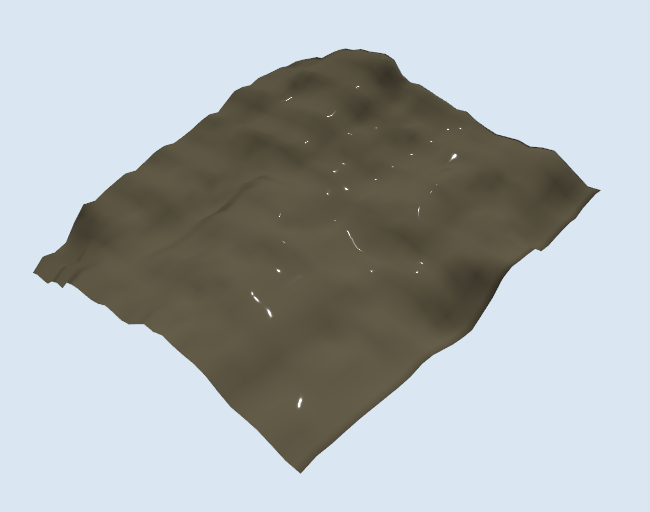

# Alishan Shizhuo UAV Simulation Environment

A real-world mountainous UAV simulation environment reconstructed from official terrain data around **Shizhuo, Alishan, Chiayi, Taiwan**.

This environment is part of the larger **Drone / Phoenix Project** and is intended to support future:

- PX4 SITL flight
- QGroundControl operation
- manual RC control
- ROS 2 autonomous navigation
- terrain following
- obstacle avoidance
- perception experiments
- mountainous UAV missions

The environment will be developed incrementally.

> **Current release: V1 — Real Roads and Geographic Structure**

---

## Project Roadmap

The Alishan environment will evolve through multiple versions.

| Version | Main Goal | Status |
|---|---|---|
| **V0** | Real 500 m × 500 m terrain geometry from official DTM | ✅ Completed |
| **V1** | Real road/path locations and basic geographic structure | ✅ Completed |
| **V2** | Vegetation, bamboo, tea plantations and buildings | Planned |
| **V3** | PX4 SITL + x500 manual flight in the environment | Planned |
| **V4** | ROS 2 autonomous navigation and terrain-following missions | Planned |
| **Later** | Weather, fog, perception, obstacle avoidance and research tasks | Planned |

Future versions will be added to this repository as the project progresses.

---

# V0 — Real Terrain Geometry

V0 focuses only on building a correct and reproducible **real-world terrain foundation**.

It does **not** attempt to make Alishan photorealistic yet.

The purpose of V0 is to verify the complete pipeline:

```text
Official Taiwan DTM
        ↓
GIS preprocessing
        ↓
Coordinate transformation
        ↓
500 m × 500 m terrain extraction
        ↓
GeoTIFF
        ↓
Gazebo Harmonic
        ↓
Real Alishan terrain geometry
```

## V0 Result

The current Gazebo environment contains a terrain-only reconstruction of a real Shizhuo area.

### Site

- **Location:** Shizhuo, Alishan, Chiayi, Taiwan
- **Center latitude:** `23.47939`
- **Center longitude:** `120.69861`
- **Area:** `500 m × 500 m`
- **Horizontal CRS:** `EPSG:3826 — TWD97 / TM2 zone 121`

### Terrain source

V0 uses the official **2025 Chiayi County 20 m Digital Terrain Model (DTM)**.

Terrain characteristics:

- Source resolution: `20 m`
- Source samples: `25 × 25`
- Minimum elevation: `1330.340 m`
- Maximum elevation: `1560.170 m`
- Elevation relief: `229.830 m`
- Center elevation: `1441.440 m`
- NoData: `0%`

The processed result is stored as a GeoTIFF and loaded directly by Gazebo through GDAL.

---

## V0 Screenshot

Place the screenshot created during V0 here:

```text
docs/images/alishan_shizhuo_v0.png
```

Then GitHub will display it automatically:



Suggested local directory:

```bash
mkdir -p docs/images
```

Save the screenshot as:

```text
docs/images/alishan_shizhuo_v0.png
```

---

# Gazebo Local Elevation Convention

The real DTM elevation is approximately:

```text
1330.340 m  →  1560.170 m
```

For simulation convenience, Gazebo uses a local vertical reference:

```text
local_z = TWVD2001_elevation - 1330.340
```

Therefore:

| Real elevation | Gazebo local Z |
|---:|---:|
| `1330.340 m` | `0.000 m` |
| `1441.440 m` | `111.100 m` |
| `1560.170 m` | `229.830 m` |

This preserves the real `229.830 m` terrain relief without forcing the simulation to operate around `z ≈ 1400 m`.

V0 intentionally does not declare a verified global vertical-datum mapping between TWVD2001 and the future PX4 / Gazebo geographic altitude reference.

---

# Software

V0 has been tested with:

- **Ubuntu 24.04**
- **Gazebo Harmonic**
- **gz-sim 8.15.0**
- **GDAL / GeoTIFF support**
- Python GIS preprocessing tools

Python dependencies are listed in:

```text
requirements.txt
```

Install them with:

```bash
python3 -m pip install --upgrade -r requirements.txt
```

---

# Running the Environment

## Recommended command: `alishan_sim`

The recommended way to launch V0 is with the custom shell alias:

```bash
alishan_sim
```

If the alias has not been created yet, add it once:

```bash
echo "alias alishan_sim='cd ~/Phenix_Project/Drone/environments/alishan_shizhuo && GZ_PARTITION=alishan_shizhuo GZ_SIM_RESOURCE_PATH=\"\$PWD/gazebo/models\" gz sim -v 4 -r gazebo/worlds/alishan_shizhuo.sdf'" >> ~/.bashrc
```

Reload the shell configuration:

```bash
source ~/.bashrc
```

Now the environment can be launched from anywhere with:

```bash
alishan_sim
```

---

## Manual launch command

Without the alias:

```bash
cd ~/Phenix_Project/Drone/environments/alishan_shizhuo

GZ_PARTITION=alishan_shizhuo \
GZ_SIM_RESOURCE_PATH="$PWD/gazebo/models" \
gz sim -v 4 -r gazebo/worlds/alishan_shizhuo.sdf
```

The `GZ_PARTITION` value isolates this simulation from unrelated running Gazebo instances.

---

## Server-only launch

For a terrain-only server without the GUI:

```bash
cd ~/Phenix_Project/Drone/environments/alishan_shizhuo

GZ_PARTITION=alishan_shizhuo \
GZ_SIM_RESOURCE_PATH="$PWD/gazebo/models" \
gz sim -v 4 -r -s gazebo/worlds/alishan_shizhuo.sdf
```

---

# Terrain Preprocessing

The authoritative site configuration is:

```text
configs/site.yaml
```

Current site configuration:

```yaml
name: alishan_shizhuo
latitude: 23.47939
longitude: 120.69861
width_m: 500
height_m: 500
```

The preprocessing pipeline uses:

```text
WGS84 latitude / longitude
        ↓
EPSG:3826
        ↓
500 m × 500 m projected bounds
        ↓
Official Chiayi DTM
        ↓
GeoTIFF
```

## Reproduce the terrain crop

Download the official source archive:

```bash
curl --fail --location \
  --output data/raw/chiayi_20m_dtm_2025.zip \
  'https://www.tgos.tw:443/MDE/VirtualDir_TC/Product/e0be7bc8-714c-40b5-9658-b9269a1a73df/%E5%88%86%E5%B9%85_%E5%98%89%E7%BE%A9%E7%B8%A320MDEM%282025%29.zip'
```

Verify the archive:

```bash
sha256sum data/raw/chiayi_20m_dtm_2025.zip
```

Expected SHA-256:

```text
f004fb34ff5ceaf71a8a0a14ac0c84de27a990d5f4b3749dd09e23f0c495056c
```

Inspect the DTM:

```bash
python3 scripts/inspect_dtm.py \
  --input data/raw/chiayi_20m_dtm_2025.zip \
  --site-config configs/site.yaml
```

Crop the site:

```bash
python3 scripts/crop_dtm.py \
  --input data/raw/chiayi_20m_dtm_2025.zip \
  --site-config configs/site.yaml
```

Validate the result:

```bash
python3 scripts/validate_terrain.py \
  --input data/processed/alishan_shizhuo_terrain_20m.tif \
  --site-config configs/site.yaml
```

---

# Gazebo Terrain

The processed GeoTIFF is loaded directly into Gazebo.

Main Gazebo files:

```text
gazebo/
├── models/
│   └── alishan_shizhuo_terrain/
│       ├── model.config
│       ├── model.sdf
│       └── terrain/
│           ├── alishan_shizhuo_terrain_20m.tif
│           ├── alishan_neutral.ppm
│           └── alishan_flat_normal.ppm
│
└── worlds/
    └── alishan_shizhuo.sdf
```

The GeoTIFF terrain asset is referenced from the canonical processed terrain product.

Current Gazebo heightmap parameters:

```xml
<size>500 500 229.830</size>
<pos>0 0 -1330.340</pos>
<sampling>1</sampling>
```

The visual and collision terrain use the same source terrain data.

The neutral diffuse and normal maps are only renderer-support assets for the Ogre2 Terra heightmap shader. They are **not satellite imagery**.

---

# V1 — Real Roads and Geographic Structure

V1 retains V0's unmodified, real 20 m terrain GeoTIFF as the environment foundation and adds a deliberately small, visual-only road/path layer. It does not modify the DTM, terrain collision, PX4, ROS 2, or any other simulation integration.

## Road source

Road and path locations come from [OpenStreetMap](https://www.openstreetmap.org/) highway ways. The preferred downloader issues this narrow Overpass query:

```text
[out:json][timeout:30];
way["highway"](23.477127735,120.696157403,23.481652227,120.701062514);
out tags geom;
```

The bounding box is not a degree approximation: it is the inverse projection of the canonical EPSG:3826 500 m × 500 m site rectangle. During V1 creation the primary Overpass endpoint returned a gateway timeout, so the preserved raw source was instead obtained directly from the official OSM API:

```text
https://api.openstreetmap.org/api/0.6/map?bbox=120.696157403%2C23.477127735%2C120.701062514%2C23.481652227
```

It is stored, unchanged and ignored by Git, at:

```text
data/raw/osm/alishan_shizhuo_roads_osm-api.osm
```

The downloaded XML identifies the source as © OpenStreetMap contributors under the Open Data Commons Open Database License. See the [OpenStreetMap copyright and license notice](https://www.openstreetmap.org/copyright) before redistributing derived data.

## Coordinate and elevation pipeline

```text
OSM WGS84 LineString
        ↓ EPSG:4326 → EPSG:3826
GeoTIFF footprint → local Gazebo XY (±250 m)
        ↓ bilinear sample of the existing 20 m DTM
TWVD2001 elevation − 1330.340 m + 0.100 m
        ↓
terrain-following static OBJ ribbon
        ↓
Gazebo visual-only roads model
```

The road generator maps EPSG:3826 coordinates to the existing terrain raster's 500 m footprint, centered at local `(0, 0)`, then clips lines to that footprint. This aligns roads with the physical terrain model, including the small grid-alignment difference between the canonical site center and the grid-snapped DTM extent. It does not use arbitrary latitude/longitude offsets.

Each line is densified to a maximum 5 m horizontal segment length and sampled bilinearly from the original 20 m DTM. This interpolation follows the same coarse source surface; it does not add terrain detail or modify the GeoTIFF. The 0.100 m local-Z offset prevents z-fighting. Widths are intentionally approximate visual categories: secondary is wider; unclassified/residential/service are medium; tracks and paths are narrow.

The raw OSM response contains 22 highway ways in the terrain footprint:

```text
secondary: 1, unclassified: 3, service: 5, track: 7,
path: 1, footway: 1, steps: 4
```

For dependable Gazebo Harmonic / Ogre2 rendering, each visible category is generated as its own static OBJ and receives an explicit, matte SDF material. This avoids relying on OBJ/MTL face-material import. The roads intentionally have no separate collision geometry: V0's terrain remains the collision surface.

| OSM highway type | Visual width | Material |
|---|---:|---|
| `secondary` | 5.0 m | matte dark gray |
| `unclassified` | 3.5 m | matte medium gray |
| `service` | 2.5 m | matte light gray |
| `track` | 1.8 m | matte earth brown |
| `path` | 0.8 m | matte muted tan |
| `footway` | 0.7 m | matte muted tan |
| `steps` | hidden | intentionally omitted for a cleaner V1 overview |

The six visible categories account for 18 rendered OSM ways; all four `steps` ways are intentionally hidden. These visual widths are approximate only; road centreline coordinates, clipping, DTM sampling, and the `+0.100 m` terrain offset remain unchanged.

## Reproduce V1 road preprocessing

From this environment directory, download only the 500 m site data. The downloader never overwrites an existing raw response.

```bash
# Preferred Overpass source (JSON, if its endpoint is available)
python3 scripts/download_osm_roads.py --source overpass

# Direct official OpenStreetMap fallback (XML)
python3 scripts/download_osm_roads.py --source osm-api

# Generate the terrain-following road mesh from the source that was downloaded
python3 scripts/generate_road_mesh.py \
  --source-json data/raw/osm/alishan_shizhuo_roads_osm-api.osm

# Check model references, local bounds/Z, and the immutable V0 GeoTIFF hash
python3 scripts/validate_v1_environment.py
```

The generated mesh and metadata live under `data/processed/roads/`. The Gazebo roads model uses small model-local symlinks to those generated files, avoiding a second mesh copy.

## V1 limitations

V1 provides geographic readability, not a road-engineering model:

- OSM completeness and tags determine what is shown.
- Terrain following is constrained by the original 20 m DTM; road grade, cuttings, bridges, and embankments are not independently modeled.
- Road widths are approximate visual categories, not surveyed widths.
- Roads are visual-only; terrain collision remains authoritative.
- V1 still does **not** include buildings, vegetation, bamboo, tea-plantation geometry, satellite texture, Blender assets, PX4, ROS 2, QGroundControl, weather, or autonomous navigation.

Launch the combined terrain-and-roads V1 world with the existing command:

```bash
alishan_sim
```

or use the manual command in [Running the Environment](#running-the-environment).

---

# Validation

Validate the Gazebo terrain configuration:

```bash
python3 scripts/validate_gazebo_terrain.py

python3 scripts/validate_v1_environment.py
```

Run the full test suite:

```bash
python3 -B -m unittest discover -s tests -v
```

At the end of V0, the full suite passed:

```text
15 tests passed
```

---

# Directory Layout

```text
alishan_shizhuo/
├── README.md
├── requirements.txt
├── blender/
├── configs/
│   └── site.yaml
├── data/
│   ├── raw/
│   │   └── osm/
│   └── processed/
│       └── roads/
├── docs/
├── gazebo/
│   ├── models/
│   │   └── alishan_shizhuo_roads/
│   └── worlds/
├── scripts/
└── tests/
```

### `configs/`

Environment location and dimensions.

### `data/raw/`

Unmodified external GIS / DTM source files.

Large source archives are ignored by Git.

### `data/processed/`

Processed terrain products such as:

```text
alishan_shizhuo_terrain_20m.tif
alishan_shizhuo_terrain_preview.png
```

### `scripts/`

Reproducible GIS processing and validation tools.

### `gazebo/`

Gazebo world and terrain model.

### `tests/`

Automated checks for coordinate processing, DTM extraction and Gazebo terrain configuration.

### `blender/`

Reserved for future environment assets.

---

# V0 Completed Features

- [x] Real-world Alishan Shizhuo coordinate
- [x] Official Taiwan terrain data
- [x] WGS84 → EPSG:3826 coordinate transformation
- [x] Exact 500 m × 500 m site extraction
- [x] GeoTIFF terrain output
- [x] Real terrain elevation relief
- [x] Direct GeoTIFF loading in Gazebo
- [x] Gazebo visual terrain
- [x] Gazebo collision terrain
- [x] Terrain validation scripts
- [x] Automated tests
- [x] Simple `alishan_sim` launch command

---

# V0 Limitations

V0 intentionally focuses on terrain geometry only.

It currently does **not** include:

- satellite / aerial imagery
- roads
- buildings
- forests
- bamboo
- tea plantations
- detailed sub-20 m terrain geometry
- weather
- fog
- PX4 vehicle
- QGroundControl integration
- RC controller input
- ROS 2
- autonomous navigation

The source DTM resolution is only `20 m`, so V0 represents **large-scale terrain shape**, not fine terrain details.

Features such as:

- road embankments
- drainage channels
- tea-field terraces
- small rocks
- small elevation discontinuities

cannot be accurately represented by the current DTM alone.

---

# Future Development

## V1 — Geographic Environment

Completed in this release:

 - real road/path locations from OpenStreetMap
 - terrain-following static road ribbons
 - category-specific road widths and materials

V1 intentionally stops before land-use layers or object placement.

---

## V2 — Alishan Semantic Environment

Planned:

- forest
- bamboo
- tea plantations
- buildings
- farm roads
- improved environment assets

The goal is to preserve real geographic structure while using procedural generation for repeated objects such as trees and tea plants.

---

## V3 — PX4 Manual Flight

The next major UAV milestone will connect the environment with:

```text
Alishan terrain
      +
PX4 SITL
      +
x500
      +
QGroundControl
      ↓
Manual flight
```

The drone should be able to take off, fly over the terrain and land inside the custom Alishan Gazebo world.

---

## V4 — Autonomous UAV

Later versions will introduce:

```text
PX4
 +
ROS 2
 +
Camera / LiDAR
 +
Planning
      ↓
Autonomous mountain navigation
```

Potential experiments include:

- waypoint navigation
- terrain following
- obstacle avoidance
- coverage planning
- tea-plantation inspection
- search missions
- fog / visibility robustness

---

# Long-Term Goal

The long-term objective is to build a progressively more realistic and useful simulation environment for studying autonomous UAV operation in mountainous terrain.

Rather than creating a purely visual Alishan scene, this project prioritizes:

1. real geographic structure
2. physically meaningful scale
3. reproducible environment generation
4. PX4 compatibility
5. ROS 2 autonomy
6. simulation-to-real transfer

The environment will continue to evolve beyond V0 as the UAV project develops.
