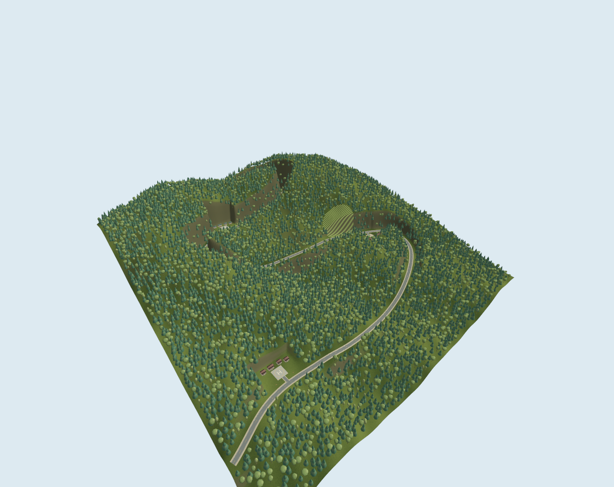
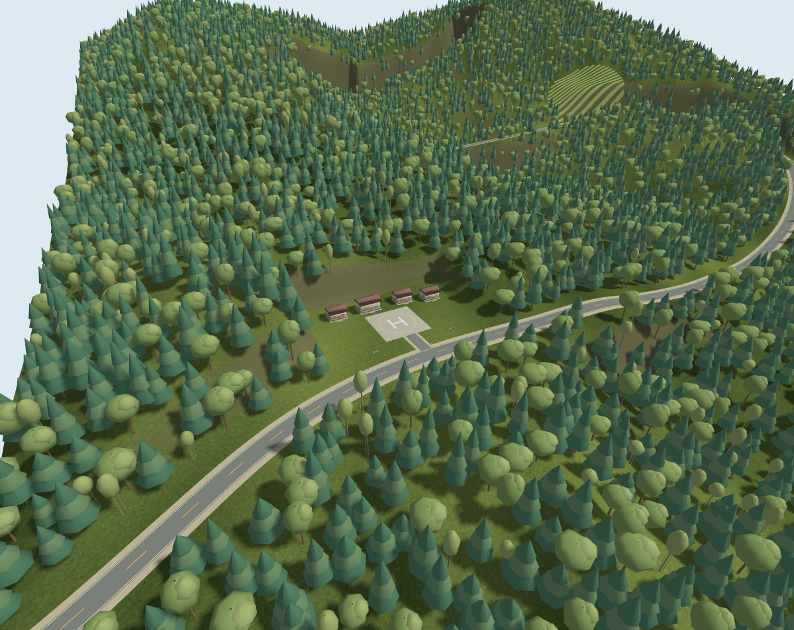

# Alishan Showcase 1km

**V1 — Showcase Scenic Environment**

A grand, forested **1 km × 1 km** mountain UAV park inspired by Alishan, Taiwan.
This is a deliberately stylized, procedural showcase for aerial simulation
demos. It is not a GIS survey or a reconstruction of a particular village.



## Launch

Requires **Gazebo Harmonic / Gazebo Sim 8** with its OGRE2 renderer.
The world was validated with Gazebo **8.15.0**. All model and texture assets are
included locally; launching requires no Python packages or Fuel downloads.

```bash
cd ~/Phenix_Project/Drone/environments/alishan_showcase_1km
./scripts/launch.sh
```

The script sets the model search path and uses the separate Gazebo transport
partition `alishan_showcase_1km`. It starts simulation and opens an overview
camera. Close the Gazebo window or press Ctrl+C in its terminal to stop.

Optional alias, which you can add to your shell configuration yourself:

```bash
alias alishan_showcase_sim='$HOME/Phenix_Project/Drone/environments/alishan_showcase_1km/scripts/launch.sh'
```

No shell configuration has been changed. For a server without a GUI:

```bash
./scripts/launch.sh -s
```

Only one session should use a given partition. To choose another:

```bash
ALISHAN_SHOWCASE_PARTITION=my_showcase ./scripts/launch.sh
```

## Included scenery

- A 1,000 × 1,000 m terrain with several ridges, a central valley, and **329.6 m
  of relief**. Local elevations range from 45.6 to 375.2 m.
- **7,182 trees and bamboo clumps:** 4,662 conifers, 1,916 broadleaf trees, and
  604 bamboo clumps. Sizes, rotations, species and placement density vary.
- **2.51 km of connected roads**, including a 9 m main carriageway, gravel
  shoulders, edge lines, dashed centre markings, and roadside posts.
- **12 cabins** in three small clusters, with gabled roofs, foundations,
  windows, entrances, and nearby benches.
- Two **28 × 28 m marked launch pads**, a lodge clearing, and tea-like planted
  rows on a hillside.
- Warm daylight, shadows, and interactive overview/detail camera presets.

The terrain is a 251 × 251 grid with 4 m spacing. Overlapping ridge functions
and smaller undulations produce the shape. A smooth road profile is graded
into the terrain; approaches and clearing terraces are flattened together.
Roads and every tree placement sample the exported terrain triangles.

The forest uses three repeated procedural silhouettes, combined into **64
spatial batches** of 125 × 125 m. It excludes roads, cabin clearings, launch
areas and the tea slope. The whole scene uses six static model groups, 69
COLLADA mesh files, and about **1.01 million visual triangles**. Model resources
occupy about **97 MB**. These are spatial mesh batches, not hardware instancing.



## Views and launch locations

With the Gazebo GUI running:

```bash
python3 scripts/view.py overview
python3 scripts/view.py aerial
python3 scripts/view.py basecamp
python3 scripts/view.py tea
python3 scripts/view.py ridge
```

Append `--capture` to save a genuine Gazebo screenshot in
`data/processed/previews/`. Presets are defined in `configs/views.json` as
`[x, y, z, pitch, yaw]`, in metres and radians. If using a custom partition, set
the same `ALISHAN_SHOWCASE_PARTITION` when running the view script.

The world uses local X/Y coordinates from **−500 to +500 m**, with Z up. Heights
are artistic local coordinates, not elevations above sea level.

| Location | X / Y (m) | Terrain Z (m) | Use |
|---|---:|---:|---|
| Cedar Basecamp | −325 / −302 | 125.551 | 28 m launch pad, four cabins |
| Tea Terrace Lodge | 260 / −73 | 170.533 | Visitor clearing, four cabins, tea slope nearby |
| Cloud Ridge | −140 / 285 | 198.097 | 28 m launch pad, four cabins |

The launch-pad top is 0.15 m above the listed terrain height. Future vehicle
placement should also account for landing-gear/body geometry.

## Regenerate and validate

Generation uses Python 3, NumPy, Pillow and Matplotlib. Dependencies are listed
in `requirements.txt`. Blender is optional; no Blender installation is needed.

```bash
python3 scripts/generate_environment.py
python3 scripts/validate_environment.py
python3 scripts/validate_environment.py --native --server
```

Regeneration overwrites generated assets and metadata inside this project using
the seed and layout in `configs/showcase.json`. Close and reopen Gazebo after
regeneration because the renderer caches loaded meshes. The configuration
describes this V1 composition; changes to terrain size or density should be
treated as a new layout and checked with the acceptance tests.

Basic validation runs six acceptance tests, checks mesh geometry and local
resources, and validates SDF. `--native` also compiles
`tests/check_gazebo_mesh.cc` and loads all meshes through Gazebo's actual
importer; it requires `c++`, `pkg-config`, and `gz-common5-graphics` development
headers. `--server` starts a separate bounded server session for 125 iterations.

Results are written to `data/processed/validation.json`; the server log is in
`data/processed/validation_runtime/server.log`. See
[validation notes](docs/validation.md) for measured results and visual evidence.
The notes also describe the optional live sphere-drop check that verified
terrain and launch-pad contact, with no test objects retained in the world.

## Collision, performance and scope

Terrain collision uses the same triangles as the terrain visual. The pads have
box collisions and cabins have simple conservative box collisions. Road
surfaces sit approximately 12–14 cm above terrain collision to avoid flicker;
the underlying terrain provides road contact. Forest, bamboo, tea rows, road
posts and benches are **visual only**. This V1 is not a tree-collision or vehicle
dynamics benchmark.

The low-poly vegetation and batched static scenery suit an aerial showcase.
Close ground views reveal simplified crowns and buildings. Strong terrain cuts
and terraces are artistic approximations, and the square boundary is visible
from outside the park. There are no distant backdrop mountains or GIS datum.
Rendering speed depends on the GPU, viewport size and shadows; no universal
frame-rate guarantee is made. For constrained hardware, reduce the forest
probability in `configs/showcase.json` and regenerate, then review the scene.

This project contains **no PX4 integration, ROS 2, QGroundControl, vehicles,
sensors, autonomy or mission logic**. A future separate task could add a PX4
vehicle, spawn configuration, vegetation collision proxies and flight checks.

Unlike `../alishan_shizhuo`, which pursues a stricter real-terrain workflow,
this showcase prioritizes composition, immediate availability and visual
clarity. It imports no Shizhuo resources and does not modify that project or
PX4-Autopilot.

## Project layout

```text
alishan_showcase_1km/
├── README.md / requirements.txt / .gitignore
├── configs/                 # Scenic layout, seed and camera presets
├── scripts/                 # Terrain/asset generation, launch, checks, views
├── data/
│   ├── raw/                 # Procedural-source note; no downloaded assets
│   └── processed/           # Terrain, placements, site plan, validation, previews
├── gazebo/
│   ├── worlds/              # alishan_showcase.sdf
│   └── models/              # terrain, roads, forest, clearings, village, tea
├── blender/                 # Optional import note
├── tests/                   # Acceptance tests and native importer check
├── docs/                    # Implementation plan and validation report
└── .runtime/                # Ignored runtime logs and local helper binaries
```

The generated meshes and texture are original procedural assets produced by
the project scripts. Gazebo references:
[MinimalScene camera](https://gazebosim.org/api/gui/8/classplugins_1_1MinimalScene.html),
[SDFormat](https://sdformat.org/), and
[Gazebo's COLLADA importer](https://github.com/gazebosim/gz-common/blob/gz-common5/graphics/src/ColladaLoader.cc).
